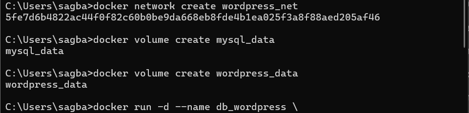
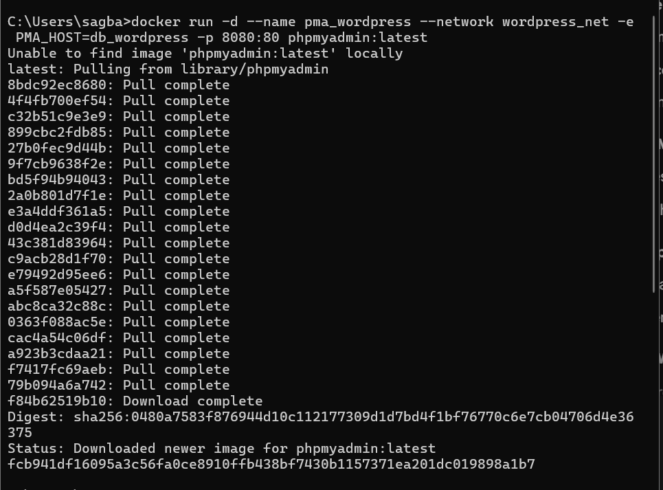
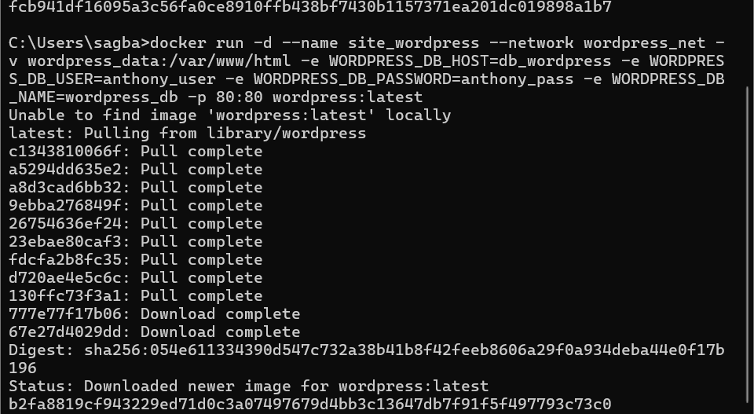
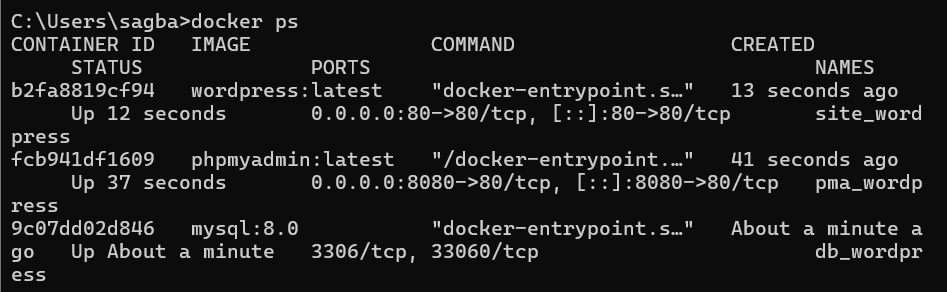
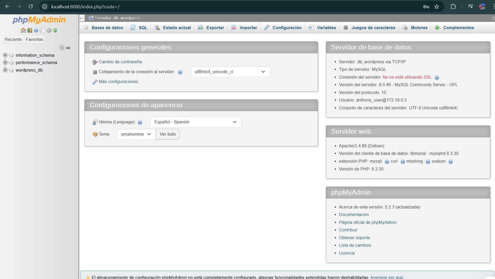
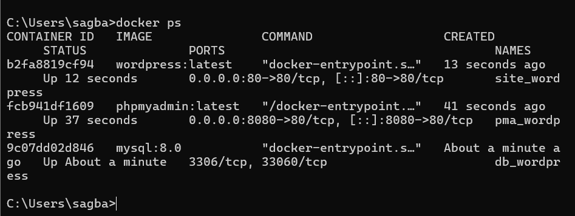
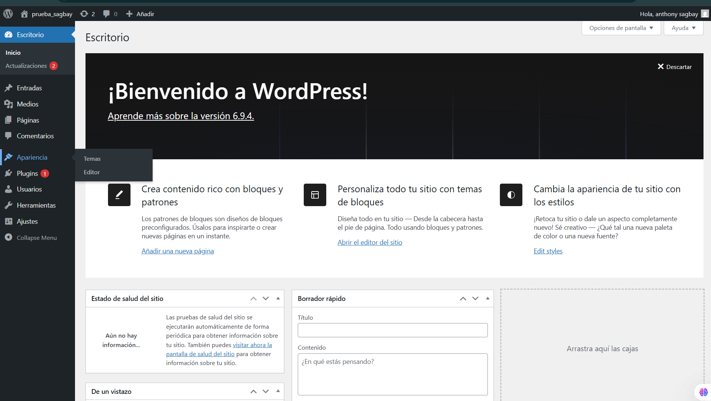
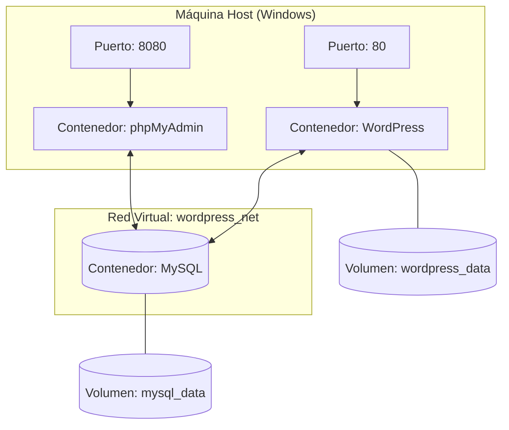

# INSTITUTO SUPERIOR TECNOLÓGICO SUDAMERICANO
## CARRERA DE DESARROLLO DE SOFTWARE

**Asignatura:** TENDENCIAS TECNOLÓGICAS - [10833]  
**Estudiante:** Anthony Sagbay  
**Semana:** 5  
**Fecha:** 6 de mayo de 2026  
**Actividad:** EVALUACIÓN - Despliegue de WordPress con Docker (CLI)

---

# 1. Título

Implementación de un CMS WordPress con persistencia de datos y administración de base de datos mediante comandos de Docker CLI.

---

# 2. Tiempo de duración

60 minutos.

---

# 3. Fundamentos

Docker permite empaquetar aplicaciones en contenedores aislados. En esta práctica se orquestaron tres servicios esenciales para un entorno web profesional:

- **MySQL 8.0:** Motor de base de datos relacional para el almacenamiento estructurado de la información del sitio.
- **WordPress:** Sistema de gestión de contenidos (CMS) para la administración de la interfaz y lógica web.
- **phpMyAdmin:** Herramienta gráfica basada en web que facilita la administración de la base de datos MySQL.
- **Volúmenes:** Mecanismos de persistencia que garantizan que los datos de la base de datos y los archivos del sitio no se eliminen al detener o borrar los contenedores.
- **Redes (Networking):** Creación de un segmento de red virtual para permitir la comunicación segura y directa entre los servicios por nombre de host sin exponer puertos internos innecesariamente.

---

# 4. Conocimientos previos

- Manejo de la Terminal de comandos en Windows (CMD / PowerShell).
- Fundamentos de virtualización ligera y arquitectura de contenedores.
- Configuración de variables de entorno y redireccionamiento de puertos de red.

---

# 5. Objetivos

- Crear una red personalizada en Docker para la intercomunicación de servicios.
- Configurar volúmenes específicos para asegurar la persistencia de archivos y bases de datos.
- Desplegar contenedores funcionales de base de datos, administrador y aplicación mediante comandos CLI.
- Validar la instalación de WordPress a través del navegador local comprobando la conectividad.

---

# 6. Equipo necesario

- Computador con Windows 10/11.
- Docker Desktop configurado con el motor WSL 2.
- Terminal de comandos (CMD).
- Navegador web (Chrome, Edge o Firefox).

---

# 7. Procedimiento

## Paso 1: Creación de Red y Volúmenes de Datos

Se preparó el entorno virtual para la conectividad y el almacenamiento persistente de los datos corporativos.

```bash
docker network create wordpress_net
docker volume create mysql_data
docker volume create wordpress_data
```

### Evidencia


## Paso 2: Despliegue de la Base de Datos (MySQL)

Se ejecutó el contenedor de base de datos vinculando el volumen persistente y la red interna establecida.

```bash
docker run -d --name db_wordpress --network wordpress_net -v mysql_data:/var/lib/mysql -e MYSQL_ROOT_PASSWORD=root_password -e MYSQL_DATABASE=wordpress_db -e MYSQL_USER=anthony_user -e MYSQL_PASSWORD=anthony_pass mysql:8.0
```

### Evidencia



## Paso 3: Configuración de phpMyAdmin

Se habilitó la interfaz de gestión de bases de datos mapeando el puerto host 8080 al puerto 80 del contenedor.

```bash
docker run -d --name pma_wordpress --network wordpress_net -e PMA_HOST=db_wordpress -p 8080:80 phpmyadmin:latest
```

### Evidencia


## Paso 4: Lanzamiento de la Aplicación WordPress

Se desplegó el contenedor principal, conectándolo a la base de datos y mapeándolo al puerto 80 para el acceso del usuario.

```bash
docker run -d --name site_wordpress --network wordpress_net -v wordpress_data:/var/www/html -e WORDPRESS_DB_HOST=db_wordpress -e WORDPRESS_DB_USER=anthony_user -e WORDPRESS_DB_PASSWORD=anthony_pass -e WORDPRESS_DB_NAME=wordpress_db -p 80:80 wordpress:latest
```

### Evidencia





## Paso 5: Verificación de Estado (Docker PS)

Se confirmó la correcta ejecución de los tres servicios mediante el comando de inspección de procesos de Docker.

```bash
docker ps
```

### Evidencia


## Paso 6: Verificación de Instalación en Navegador


### Evidencia



# 8. Diagrama de Arquitectura de la Solución



---

# 9. Resultados y Conclusiones

Se logró desplegar satisfactoriamente una infraestructura multicapa funcional utilizando únicamente comandos de la CLI de Docker.

La implementación de volúmenes garantizó que la información generada por el estudiante Anthony Sagbay sea persistente ante fallos o reinicios de los contenedores.

La red personalizada permitió un entorno de desarrollo aislado donde los servicios se comunican de forma eficiente mediante DNS interno de Docker, sin exponer la base de datos al exterior.

El uso de Docker simplificó la instalación y administración de los servicios necesarios para ejecutar WordPress, permitiendo una implementación rápida, organizada y portable.

---

# 10. Referencias (APA 7)

Docker Inc. (2026). *Docker Documentation: Manage data in Docker*. https://docs.docker.com/

Oracle Corporation. (2026). *MySQL 8.0 Reference Manual*. https://dev.mysql.com/doc/

phpMyAdmin Team. (2026). *phpMyAdmin Documentation*. https://www.phpmyadmin.net/docs/

WordPress.org. (2026). *How to install WordPress with Docker*. https://wordpress.org/support/article/how-to-install-wordpress/